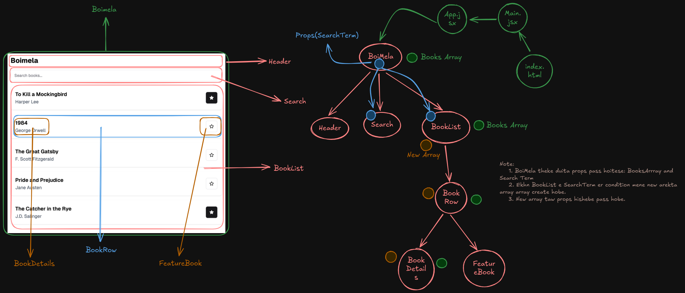

# BoiMela

This project is a book management application called "Boimela" built with React. It allows users to view a list of books, search for them by title, and mark books as favorites by clicking on a star icon.

## 📂 Features

- Search functionality to filter books by title
- Feature to mark/unmark books as favorites
- Component-based architecture
- Styled with TailwindCSS

## 📦 Installation & Running the Project

To run this project locally, follow these steps:

1. Clone the repository:
   ```sh
   git clone https://github.com/jihad-islam/Boimela.git
   ```
2. Navigate to the project directory:
   ```sh
   cd BOIMELA
   ```
3. Install dependencies:
   ```sh
   yarn
   ```
4. Start the development server:
   ```sh
   yarn dev
   ```
5. For Lucide Star:
   ```sh
   yarn add lucide-react
   ```

## 📷 Screenshots

### Component Breakdown and Hierarchy Diagram



## 🚀 Github Repository Link

[GitHub Repository](https://github.com/jihad-islam/Boimela.git)
